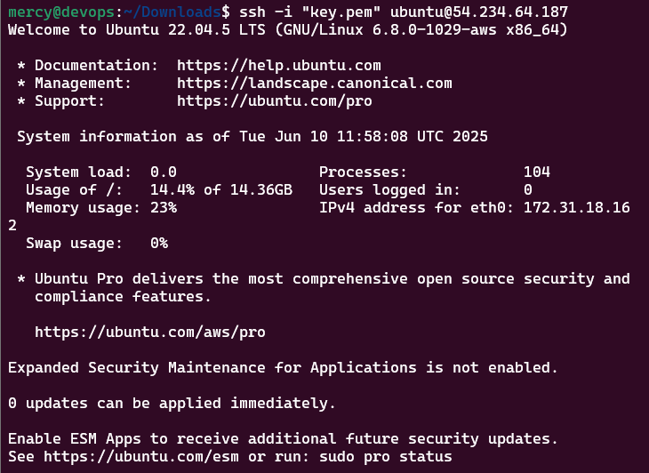

# Basic-Linux-Commands
A beginner-friendly guide to essential Linux commands used for navigating, managing files, and handling system tasks. Ideal for new users working on Ubuntu or any Linux distribution.

## 1. Linux Commands

Linux commands are executed by entering text in the terminal and pressing Enter.

**General Syntax:**

    CommandName [option(s)] [parameter(s)]

   * CommandName: The actual command to execute
   * [option(s)]: Optional flags that modify behavior (usually start with - or --)
   * [parameter(s)]: Required or optional arguments/values

   e.g ls -la /home/user

   ls (command) -la (options) /home/user (parameter)

## 2. Manipulating files and directories on Linux

Working with Linux is basically working with files and directories in any provisioned server.

**`Sudo` Command:** "Sudo" means "Superuser do", it allows you to run commands with the security priviledges of another user. e.g a "superuser" or "root"

**Creating a Folder with Sudo**

 1. Open terminal and ssh into your provisioned server. 

 

 2. Create a folder in a resticted area: This will output permission denied error as it is reserved for the root user and not regular users

 

 3. Create with `sudo` and Verify

 

 **`cd` Command:** "cd" means "Change Directory" it is used for navigating through the files and directories in a Linux system.

 **`pw`Command:** "pw" means "Present Working Directory" command, it show your current working directory.

 **`ls`Command:** "ls" means "list" command, list the content of a directory/file.

 1. Change directory into the root "/", confirm and show content.

 

## Side Hustle Task 1

 * Create a directory called `photos` inside the `/usr` directory.  
 * Navigate into the `photos` directory.
 * Create 3 more random directories inside the `photos` directory.
 * Show the newly created directories on the terminal.
 * Navigate into one of them.
 * Show the full path where you currently are on the screen

 

**`cat` Command:** "Concatenate" or "cat" lists, combines, and writes file content to the terminal console. 

**`cp` Command:** "cp" which means "Copy" 
is used to copy files or directories and their content.

**`mv` Command:** "mv" stands for "move", it is used to move and rename files and directories.

**`rm` Command:** "rm" stands for "remove" or "delete", it is used for deleting files within a directory in different ways.

**`find` Command:** AS it implies it searches for files within aspecific directory and perform subsequent opearations. For instance the command in the image below list only directories under /etc

## Challenge 
1.  Permission Denied Errors
Cause: Trying to search in directories the current user can’t access.

Fix: Use sudo to elevate privileges.